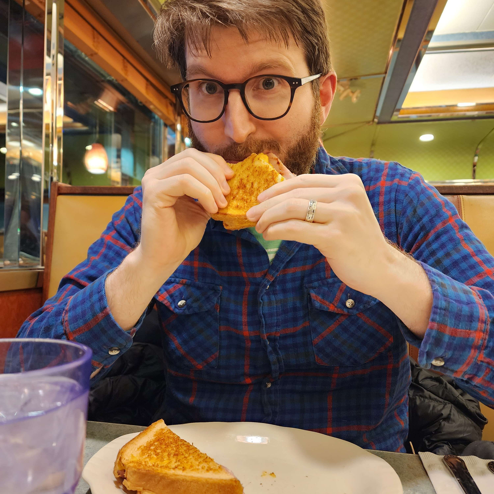

  

    
  

# Hi, I'm Alex!

I'm a composer and music producer for all sorts of media, including video games and theme songs for YouTube shows.

I'm also 1/2 of <a target="_blank" href="https://www.spellboundfire.com">Spellboundfire</a> with co-producer Travalor, where we create modern music with lots of vibrant collaborators.

If you’d like to get in touch or collaborate, you can always email me at <a href="mailto:alexflannelmusic@gmail.com" target="_blank">alexflannelmusic@gmail.com</a>

<a target="_blank" href="https://www.instagram.com/alexflannel/" class="fa fa-instagram"/>
<a target="_blank" href="https://soundcloud.com/alexflannel" class="fa fa-soundcloud"/>
<a target="_blank" href="https://spotify.com/alexflannel" class="fa fa-spotify"/>

# Projects

I have fond memories of every project I’ve worked on. Nothing beats a great collaboration. Through these projects, <a href="https://store.steampowered.com/app/934840/FrostRunner/" target="_blank">thousands of players</a> have heard my music across the world. It’s a weird thing to say, but, ya know, the Internet.

## Bonus Action

- Type: Actual Play TTRPG channel
- Creator: pReview'd
- Summary: "Adam and Jay from the reaction channel pReview'd have started an Actual Play TTRPG channel with their DM friend David Armstrong. Come by Mondays at 7pm EST as your #internetbestfriends, along with their comedian friends, as they goof and gab through the magical world of Wild Country."
- Role: Co-Composer with <a href="http://amandalnicholas.com/" target="_blank">Amanda Nicholas</a>, Co-Producer with <a href="https://www.instagram.com/travalor" target="_blank">Travalor</a>

### Time to Be a Hero

<iframe style="margin: 0 0 1em 0;" width="100%" height="300" scrolling="no" frameborder="no" allow="autoplay" src="https://w.soundcloud.com/player/?url=https%3A//api.soundcloud.com/tracks/1646102787%3Fsecret_token%3Ds-XlBVNPDqPSX&color=%23ff5500&auto_play=false&hide_related=false&show_comments=true&show_user=true&show_reposts=false&show_teaser=true&visual=true"></iframe>

## Ludicrous Text Adventures: Worthless Dirt Boys (2021)

- Type: Text Adventure
- Creator: Impish Intern Games
- Summary: “Your teen baseball team, the Worthless Dirt Boys, has lost to America’s Perfect Boys every year since 1922. Can you give your underdogs a fighting chance with steroids, guns, and blood magic? Explore 5+ endings, branching romance, ludicrous training exercises, and more in this absurdly funny narrative RPG.” — from Newgrounds
- Role: Composer
- Reception: Frontpaged and received Daily 3rd Place on Newgrounds

### “Dirtville (Day Theme)”

<iframe style="margin: 0 0 1em 0;" width="100%" height="300" scrolling="no" frameborder="no" allow="autoplay" src="https://w.soundcloud.com/player/?url=https%3A//api.soundcloud.com/tracks/1186706170%3Fsecret_token%3Ds-XF3uZp0klmE&amp;color=%23ff5500&amp;auto_play=false&amp;hide_related=false&amp;show_comments=true&amp;show_user=true&amp;show_reposts=false&amp;show_teaser=true&amp;visual=true"></iframe>

### “Dirtville (Night Theme)”

<iframe style="margin: 0 0 1em 0;" width="100%" height="300" scrolling="no" frameborder="no" allow="autoplay" src="https://w.soundcloud.com/player/?url=https%3A//api.soundcloud.com/tracks/1186706248%3Fsecret_token%3Ds-jLnpDgRiZX5&amp;color=%23ff5500&amp;auto_play=false&amp;hide_related=false&amp;show_comments=true&amp;show_user=true&amp;show_reposts=false&amp;show_teaser=true&amp;visual=true"></iframe>

### “Game Day!”

<iframe style="margin: 0 0 1em 0;" width="100%" height="300" scrolling="no" frameborder="no" allow="autoplay" src="https://w.soundcloud.com/player/?url=https%3A//api.soundcloud.com/tracks/1186706206%3Fsecret_token%3Ds-8erF9AwrAp9&amp;color=%23ff5500&amp;auto_play=false&amp;hide_related=false&amp;show_comments=true&amp;show_user=true&amp;show_reposts=false&amp;show_teaser=true&amp;visual=true"></iframe>

## FrostRunner (2019)

- Type: 3D First-Person Platformer
- Creator: Think Arcade
- Summary: “FrostRunner is a first-person platformer ‘speedrunning’ game, where the player rapidly completes platforming challenges before the timer runs out.” — from Steam
- Role: Composer
- Reception: Over 2.5k overwhelmingly positive reviews

### “Ice Flow (Main Theme)”

<iframe style="margin: 0 0 1em 0;" width="100%" height="300" scrolling="no" frameborder="no" allow="autoplay" src="https://w.soundcloud.com/player/?url=https%3A//api.soundcloud.com/tracks/870359632%3Fsecret_token%3Ds-MOj4PxshVGz&amp;color=%23ff5500&amp;auto_play=false&amp;hide_related=false&amp;show_comments=true&amp;show_user=true&amp;show_reposts=false&amp;show_teaser=true&amp;visual=true"></iframe>

## Garden Life (2020)

- Type: Garden Simulator
- Creator: Joe Frizzell
- Summary: Sometimes, ya just have a hankering for watering plants and 🌱 watching them grow 🌺
- Role: Composer + Sound Designer

### “Day Theme/Night Theme”

<iframe style="margin: 0 0 1em 0;" width="100%" height="300" scrolling="no" frameborder="no" allow="autoplay" src="https://w.soundcloud.com/player/?url=https%3A//api.soundcloud.com/tracks/947023894%3Fsecret_token%3Ds-rvsOEa25Y1L&amp;color=%23ff5500&amp;auto_play=false&amp;hide_related=false&amp;show_comments=true&amp;show_user=true&amp;show_reposts=false&amp;show_teaser=true&amp;visual=true"></iframe>

## Blood Bath & Beyond (2020)

- Type: Text Adventure
- Creator: Neil Floyd
- Summary: “A fantasy text adventure into the dark heart of retail” — Neil Floyd, author
- Role: Composer

### The Customer is Always Dead

<iframe width="100%" height="300" scrolling="no" frameborder="no" allow="autoplay" src="https://w.soundcloud.com/player/?url=https%3A//api.soundcloud.com/tracks/872353018%3Fsecret_token%3Ds-icrVIRpiE1n&amp;color=%23ff5500&amp;auto_play=false&amp;hide_related=false&amp;show_comments=true&amp;show_user=true&amp;show_reposts=false&amp;show_teaser=true&amp;visual=true"></iframe>

## Interstellar Racing League (2018)

- Type: 3D Racing
- Creator: SMU Guildhall
- Summary: “Interstellar Racing League is a 4-player couch competitive splitscreen racing game in a futuristic sci-fi setting” — Gerald Milton, game producer
- Role: Composer

### “The Race Chooses You (Main Theme)”

<iframe style="margin: 1em 0;" width="100%" height="300" scrolling="no" frameborder="no" allow="autoplay" src="https://w.soundcloud.com/player/?url=https%3A//api.soundcloud.com/tracks/870359623%3Fsecret_token%3Ds-GX3EHU39r5J&amp;color=%23ff5500&amp;auto_play=false&amp;hide_related=false&amp;show_comments=true&amp;show_user=true&amp;show_reposts=false&amp;show_teaser=true&amp;visual=true"></iframe>

<!-- 

# Ethos

I think it was _Heroes of Might and Magic_ for Game Boy Color that really did it for me.

On long car rides, I’d stick the speaker in my ear and let the title menu theme play. Honestly, I think it’s the perfect theme, and does what it sets out to:

- creates a specific mood
- includes only what’s necessary to achieve that mood
- captures the player’s imagination

These are my goals for any of my compositions. I’ve happily followed this regimen in the several collaborations I’ve been a part of. -->
